### 进制基础知识

进制概述:

​	指进制位，是一种记数方式，也称为进位计数法或位值计数法

十进制：0,1,2,3,4,5,6,7,8,9

R进制：由0~(R-1)组成，并且每一位上的数逢R进1


我们的计算机是由逻辑电路组成，逻辑电路通常只有2个状态：开关的接通与断开

这种状态正好可以用“1”和“0”表示，也就是我吗要讲解的组成二进制的数字符号

常见进制的数据组成

二进制：0,1 在java中以0b开头

八进制：0,1,2,3,4,5,6,7。在java中以0开头

十进制：0,1,2,3,4,5,6,7,8,9。整数默认是十进制

十六进制：0,1,2,3,4,5,6,7,8,9,A,B,C,D,E,F(大小写均可)。在java中以0x开头

举例：

二进制：10000000000

八进制：2000

十六进制：400

进制越大，表现形式越短


### 进制转换

R进制到十进制的转换

规则：按权展开法（系数*基数的权次幂相加）

系数：每一【位】上的数

基数：R进制，基数就是R

权：从数值的右侧，以0开始编号，对于位上的编号就是该位上的权

```java
// ^表示次方

// 二进制转十进制
	0b101010	= 1*2^5 + 0*2^4 + 1*2^3 + 0*2^2 + 1*2^1 + 0*2^0
				= 32 + 0 + 8 + 0 + 2 + 0	
// 八进制转十进制  
	052		= 5*8^1 + 2*8^0
    		= 40 + 2	
// 十六进制转十进制 
    0x2A	= 2*16^1 + 10*16^0
        	= 32 + 10
```

十进制到R进制的转换

规则：重复相除法（除基取余，直到商为0，余数反转）

把42转为二进制


如何进行二进制和十进制的快速转换呢？

采用8421码就可以实现

8421码：

是BCD代码中最常用的一种

BCD:(Binary-Code Decimal)二进制码十进制数，在这种编码方式中，每一位二进制代码的1都是代表一个固定数值，把每一位的1代表的十进制数加起来得到的结果就是他所代表的十进制数码

二进制转十进制


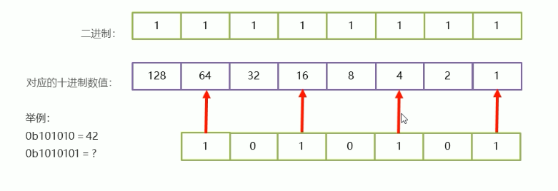

十进制转二进制

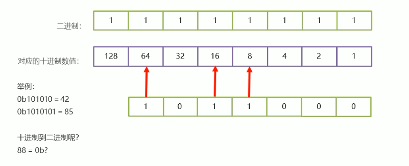

二进制到八进制如何转换？

思路1：把二进制转换为十进制，然后再把该十进制转换为八进制

思路2：三位组合法

把二进制的数据从右开始，每3位一组合，最左边不够的时候补0，然后分别计算对应的十进制数值，最后从左往右把每个十进制的数据组合起来，就是一个把进制数据

 

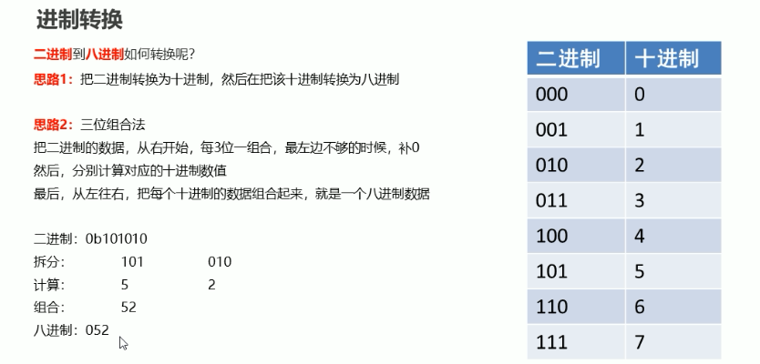

  

二进制转十六进制

  

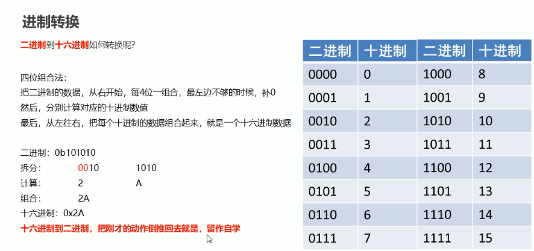

总结


### 有符号数据表示法

十进制的数据

+表示整数

-表示负数

计算机中的数据

0表示正数

1表示负数

而对于计算机识别的数据来说，0和1本身也表示数据值，那么我们怎么判断他是数值位还是符号位呢？

**规定：符号位位于数值第一位**

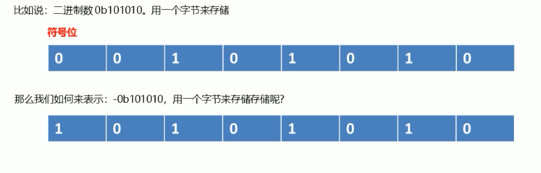

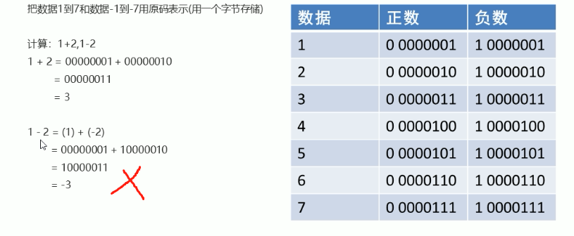

 反码表示法


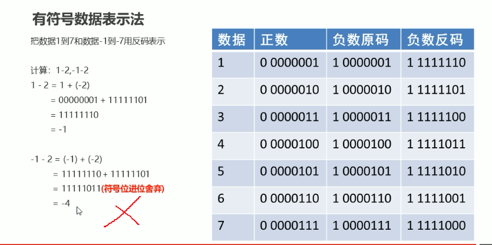

补码表示法

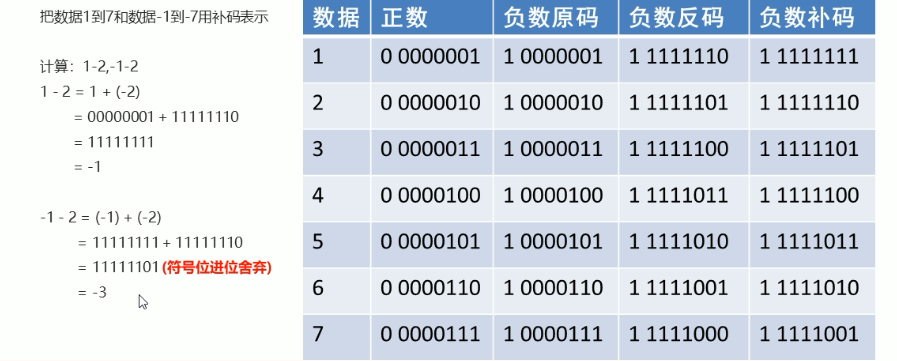

总结：

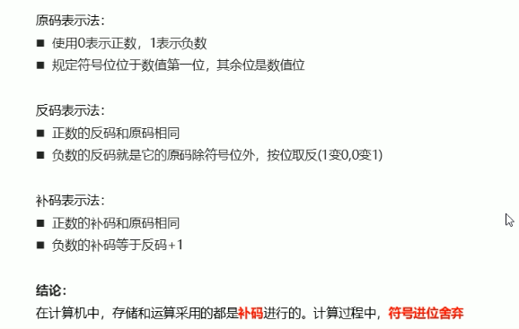

## 整数强制转换之数据溢出

```java
public static void main(String[] args) {
	byte b = (byte) 130;
	System.out.println(b);
}
```

执行结果是：-126

分析：

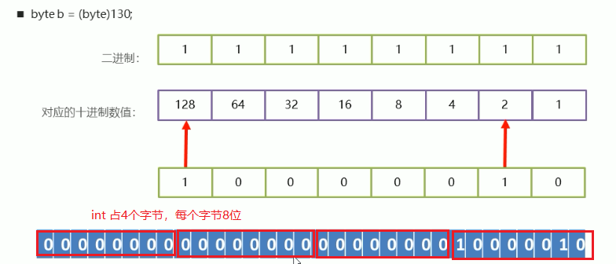

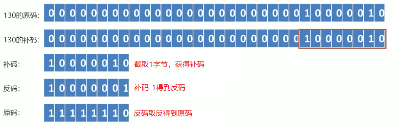

结果：-126

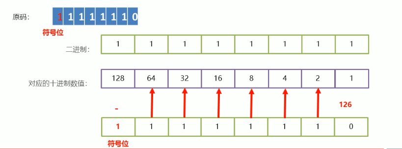

计算：byte b = (byte) 300;

| -    | -    | -    | -    | -    | 1024 | 512  | 256  | 128  | 64   | 32   | 16   | 8    | 4    | 2    | 1    |
| ---- | ---- | ---- | ---- | ---- | ---- | ---- | ---- | ---- | ---- | ---- | ---- | ---- | ---- | ---- | ---- |
|      |      |      |      |      |      |      | 1    | 0    | 0    | 1    | 0    | 1    | 1    | 0    | 0    |

300 原码：00000000-00000000-00000001-00101100

补码：00101100   符号位为0，补码和原码一样

原码：00101100

结果：44

计算：byte b = (byte) 500;

| -    | -    | -    | -    | -    | 1024 | 512  | 256  | 128  | 64   | 32   | 16   | 8    | 4    | 2    | 1    |
| ---- | ---- | ---- | ---- | ---- | ---- | ---- | ---- | ---- | ---- | ---- | ---- | ---- | ---- | ---- | ---- |
|      |      |      |      |      |      |      | 1    | 1    | 1    | 1    | 1    | 0    | 1    | 0    | 0    |

500 原码：00000000-00000000-00000001-11110100

补码：11110100	符号位为1，需要计算反码

反码：11110011	补码-1

原码：10001100

结果：-12


## 浮点数存储

二进制浮点数转十进制浮点数

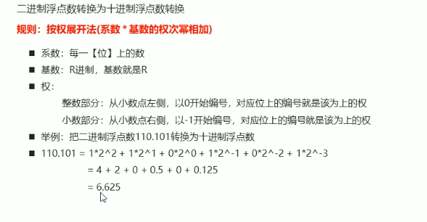

十进制浮点数转二进制浮点数

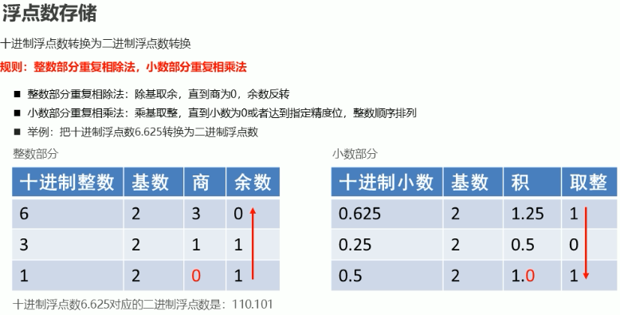

计算1010.0101的十进制

```
1010.0101	=	1*2^3 +	0*2^2 +1*2^1+0*2^0.0*2^-1	+	1*2^-2	+	0*2^-3	+	1*2^-4	
			=	8	+	0	+	2	+	0.0	+	0.25	+	0	+	0.0625
			=	10.3125
			
```

计算10.3125的二进制

整数部分

| 十进制整数 | 基数 | 商   | 余数 |
| ---------- | ---- | ---- | ---- |
| 10         | 2    | 5    | 0    |
| 5          | 2    | 2    | 1    |
| 2          | 2    | 1    | 0    |
| 1          | 2    | 0    | 1    |

整数部分是1010

小数部分

| 十进制小数 | 基数 | 积    | 取整 |
| ---------- | ---- | ----- | ---- |
| 0.3125     | 2    | 0.625 | 0    |
| 0.625      | 2    | 1.25  | 1    |
| 0.25       | 2    | 0.5   | 0    |
| 0.5        | 2    | 1.0   | 1    |

小数部分结果0.0101

最后结果1010.0101


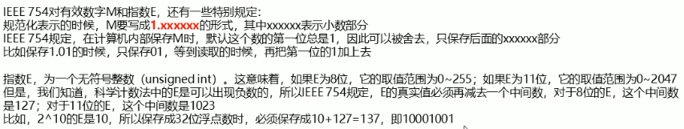

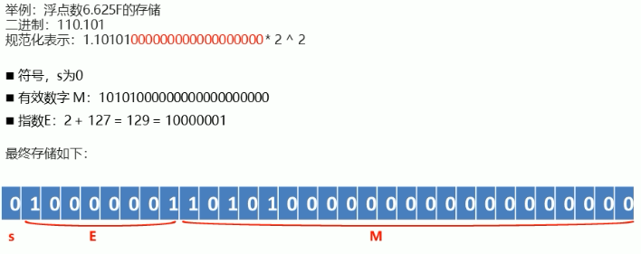

## 浮点数运算结果有误

```java
    public static void main(String[] args) {
        System.out.println(2.0F-1.5F);
        System.out.println(2.0F-1.3F);
        System.out.println(2.0F-1.4F);
    }
/**
结果为：
0.5
0.70000005
0.6
*/
```

